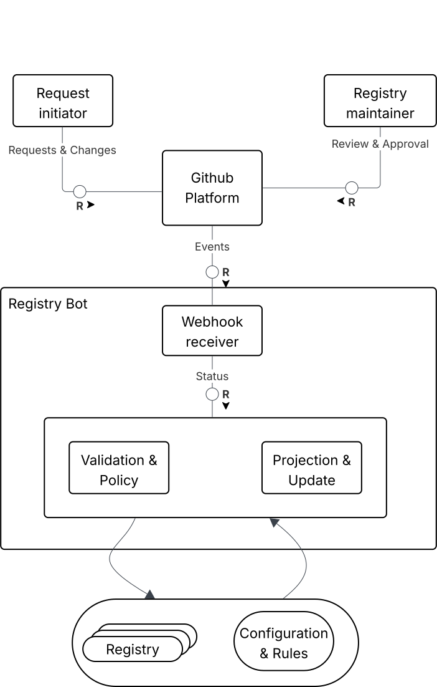

# Registry Bot

Registry Bot is a configuration-driven GitHub App built with Probot.
It automates registry requests in a target repository.
A user opens an issue based on a repo template.
The bot parses the issue content.
The bot validates the data with JSON Schema.
If the request is valid, the bot creates a pull request with a YAML entry file.
It can enable GitHub auto-merge if the repo allows it.

All behavior is defined per repository:

- `.github/registry-bot/config.yaml` or `.github/registry-bot/config.yml`
- optional runtime hooks: `.github/registry-bot/config.js`

## Features

- Config-driven behavior via `.github/registry-bot/config.yaml` or `.github/registry-bot/config.yml`.
- Each request type maps to one issue template, one JSON schema, and one target folder.
- One routing label on the issue selects the request type.
- Templates can be GitHub Issue Forms (`.yml/.yaml`) or Markdown templates (`.md`).
- The bot parses the issue body into form data.
- Validation uses JSON Schema draft 2020-12 with AJV.
- Optional hooks can change form data and add extra validation rules.
- Optional approval hooks can auto-approve requests after validation.
- Hook HTTP calls are restricted. HTTPS only. Host allowlist. Timeouts.
- The bot blocks duplicates. It checks if the YAML entry already exists.
- For valid requests, it creates a branch, writes a YAML file, and opens a pull request.
- It can enable GitHub auto-merge when repo rules allow it.
- It validates the static config on pushes to the default branch.

## Requirements

- **Node.js 18+** (LTS recommended)
- **npm**, **yarn**, or **pnpm** for dependency management
- **GitHub App credentials** (created via [GitHub Developer Settings](https://docs.github.com/en/apps/creating-github-apps/creating-a-github-app))
  Required permissions:
  - **Issues** (read & write)
  - **Pull requests** (read & write)
  - **Contents** (read & write)
  - **Metadata** (read-only)
  - **Checks** (read-only)
  - **Workflows** (read-only)

## Testing with Example Registry

The bot is designed to operate against a dedicated **registry repository** that stores structured YAML entries such as namespaces, products, or vendors.
A preconfigured testing setup is available for local development and integration testing:

- [`registry-bot`](https://github.tools.sap/ORD/github-registry-bot) → GitHub App source code (this repository)
- [`example-registry`](https://github.tools.sap/cpa-namespace-registry-bot/example-registry) → sample registry repository used for validation, PR creation, and schema testing

⚠️ **Important:**
Because this is a GitHub App, it must be **installed on the target repository** to receive webhook events.
Without installation, events like `issues.opened`, `issue_comment.created`, or `check_suite.completed` will never reach the bot.

## Usage

### Submitting a registry request

1. Open a new issue.
2. Pick a registry request template from the repository.
3. Ensure the routing label is on the issue.
4. Fill all required form fields.
5. Submit the issue.

### Validation

- The bot parses the issue content.
- It posts one validation comment and updates it on changes.
- If there are errors, fix them and edit the issue.
- The bot re-validates on each new event.

### Pull request creation

- When validation passes, the bot creates a branch.
- It writes the YAML entry file to the configured folder.
- It opens a pull request.
- It tries to enable auto-merge if allowed by the repository.

### Review and merge

- Review and approve the pull request.
- Optionally, `onApproval` can auto-approve eligible requests after validation.
- With auto-merge enabled, GitHub merges when all checks pass.
- If auto-merge is not enabled, the bot adds a merge-candidate label.

### Static Configuration

The bot is configured per repository via:

`.github/registry-bot/config.yaml`

At minimum, this file must define how issue templates map to target folders and JSON schemas.
The `issueTemplate` keys must match the **issue template filenames** (without `.yml` / `.yaml`), and each entry must provide:

- `folderName` – target folder for the generated YAML files (e.g. `/namespaces`, `/vendors`)
- `schema` – path to the JSON schema used for validation (relative to the repo root or `.github/registry-bot`)

PR and workflow behavior are optional and can be customized via the `pr` and `workflow` sections.
If `workflow.approvers` is empty or missing, any user except the issue author can approve.

### Static Configuration

The bot is configured per repository using:

`.github/registry-bot/config.yaml`

The config must define **requests**. Each request type maps to:

- `folderName`: target folder for generated YAML files (e.g. `/data/namespaces`)
- `schema`: JSON schema path used for validation
- `issueTemplate`: path to the GitHub issue template
- `approvers`: optional list of approvers for this request type

Example:

```yaml
requests:
  systemNamespace:
    folderName: /data/namespaces
    schema: './request-schemas/system-namespace.schema.json'
    issueTemplate: '../ISSUE_TEMPLATE/1-system-namespace-request.yaml'
    approvers: ['C5123154', 'D012312']
  subContextNamespace:
    folderName: /data/namespaces
    schema: './request-schemas/sub-context-namespace.schema.json'
    issueTemplate: '../ISSUE_TEMPLATE/2-sub-context-namespace-request.yaml'
  authorityNamespace:
    folderName: /data/namespaces
    schema: './request-schemas/authority-namespace.schema.json'
    issueTemplate: '../ISSUE_TEMPLATE/3-authority-namespace-request.yaml'
  product:
    folderName: /data/products
    schema: './request-schemas/product.schema.json'
    issueTemplate: '../ISSUE_TEMPLATE/4-product-request.yaml'
```

### pr section (optional)

Configures how the bot names branches and pull requests:

```yaml
pr:
  branchNameTemplate: 'feat/resource-{resource}-issue-{issue}'
  titleTemplate: 'Add {type} {resource}'
  autoMerge:
    enabled: true
    method: 'squash'
```

- `branchNameTemplate` controls branch names.
- `titleTemplate` controls PR titles.
- `autoMerge.enabled` enables auto merge.
- `autoMerge.method` must be merge, squash, or rebase.

### workflow section (optional)

Controls labels and approvers:

```yaml
workflow:
  labels:
    authorAction: 'Requester Action'
    approverAction: 'Review Pending'
    approvalRequested: ['Review Pending']
    approvalSuccessful: ['Approved']
    autoMergeCandidate: 'auto-merge-candidate'
  approvers: ['C5388932', 'D068547']
```

- `workflow.labels.*`: labels used by the bot during the lifecycle.
- `workflow.approvers`: default approvers for all requests.
  - If empty or missing, any user except the issue author can approve.

### Configuration Options

#### Top-level structure

| Field      | Type           | Required | Description                                             |
| ---------- | -------------- | -------- | ------------------------------------------------------- |
| `requests` | object         | yes      | Maps request types to their configuration.              |
| `pr`       | object \| null | no       | Controls pull request creation and auto-merge behavior. |
| `workflow` | object \| null | no       | Controls labels, approvers, and workflow behavior.      |

---

#### `requests` (required)

| Field                         | Type             | Required | Description                                                               |
| ----------------------------- | ---------------- | -------- | ------------------------------------------------------------------------- |
| `<requestType>`               | object           | yes      | One request configuration (key name is arbitrary).                        |
| `<requestType>.folderName`    | string \| null   | yes      | Target folder for generated YAML files.                                   |
| `<requestType>.schema`        | string \| null   | yes      | Path to the JSON schema used for validation.                              |
| `<requestType>.issueTemplate` | string \| null   | yes      | Path to the GitHub issue template file.                                   |
| `<requestType>.approvers`     | string[] \| null | no       | Optional approvers for this request type. Overrides `workflow.approvers`. |

---

#### `pr` (optional)

| Field                      | Type           | Required             | Description                       |
| -------------------------- | -------------- | -------------------- | --------------------------------- |
| `pr.branchNameTemplate`    | string \| null | no                   | Template for branch names.        |
| `pr.titleTemplate`         | string \| null | no                   | Template for pull request titles. |
| `pr.commitMessageTemplate` | string \| null | no                   | Template for commit messages.     |
| `pr.autoMerge`             | object \| null | yes (if `pr` exists) | Auto-merge configuration.         |

**`pr.autoMerge`**

| Field     | Type            | Required | Description                                   |
| --------- | --------------- | -------- | --------------------------------------------- |
| `enabled` | boolean \| null | yes      | Enables auto-merge.                           |
| `method`  | string \| null  | yes      | Merge method: `merge`, `squash`, or `rebase`. |

---

#### `workflow` (optional)

| Field                | Type             | Required                   | Description                         |
| -------------------- | ---------------- | -------------------------- | ----------------------------------- |
| `workflow.labels`    | object \| null   | yes (if `workflow` exists) | Labels used by the bot.             |
| `workflow.approvers` | string[] \| null | yes (if `workflow` exists) | Default approvers for all requests. |
| `workflow.links`     | object \| null   | no                         | Optional documentation links.       |

**`workflow.labels`**

| Field                | Type             | Required | Description                              |
| -------------------- | ---------------- | -------- | ---------------------------------------- |
| `global`             | string[] \| null | yes      | Global labels applied to requests.       |
| `authorAction`       | string \| null   | yes      | Label for requester action required.     |
| `approverAction`     | string \| null   | yes      | Label for reviewer action required.      |
| `approvalRequested`  | string[] \| null | yes      | Labels indicating approval is requested. |
| `approvalSuccessful` | string[] \| null | yes      | Labels indicating approval was given.    |
| `autoMergeCandidate` | string \| null   | yes      | Label for auto-merge candidate PRs.      |

**`workflow.links`**

| Field  | Type           | Required | Description                          |
| ------ | -------------- | -------- | ------------------------------------ |
| `docs` | string \| null | no       | Markdown text shown in bot comments. |

### Runtime hooks (optional)

You can add custom validation in:

`.github/registry-bot/config.js`

This file is loaded at runtime.
It can add extra checks on top of JSON Schema.
Use it for repo-specific rules or external lookups.

#### Supported hook

- `onValidate(args)`
  - Runs during validation.
  - Receives `requestType`, `form`, and `log` (plus other context values).
  - Must return an array of validation errors.
  - Return `[]` if everything is fine.
- `onApproval(args)`
  - Runs after validation and parent checks passed.
  - Receives request context similar to `onValidate`.
  - Can return an approval decision for automatic approval handling.
  - If omitted, the normal manual review flow stays unchanged.

#### Example (product lookup)

```js
// .github/registry-bot/config.js

async function validateProductRegistration({ form, log }) {
  const errors = [];

  // Example: check Product ID against SAP Business Accelerator Hub
  // and add field-level errors if mismatch is detected.

  return errors;
}

export async function onValidate({ requestType, log, ...rest }) {
  try {
    switch (requestType) {
      case 'product':
        return await validateProductRegistration({ log, ...rest });
      default:
        return [];
    }
  } catch (e) {
    log.error({ err: e?.message ?? String(e) }, 'hook:onValidate:error');
    return [`Runtime error during validation: ${e?.message ?? String(e)}`];
  }
}

export async function onApproval({ requestType, log, ...rest }) {
  try {
    switch (requestType) {
      case 'product':
        return { approved: false };
      default:
        return { approved: false };
    }
  } catch (e) {
    log.error({ err: e?.message ?? String(e) }, 'hook:onApproval:error');
    return { approved: false };
  }
}

export default { onValidate, onApproval };
```

If config.js is missing, the bot runs with built-in validation only.

## Architecture

### Block diagram



> Source file: [docs/Registry-bot-TAM-Block-Diagram.svg](docs/Registry-bot-TAM-Block-Diagram.svg)

### Activity diagram

Shows the flow until PR creation and auto-merge setup.


> Source file: [docs/Activity v0.svg](docs/Activity%20v0.svg)

### Sequence diagram

Shows the happy path call sequence.


> Source file: [docs/Sequence v0.svg](docs/Sequence%20v0.svg)

## Acknowledgements

- Built with [Probot](https://probot.github.io).
