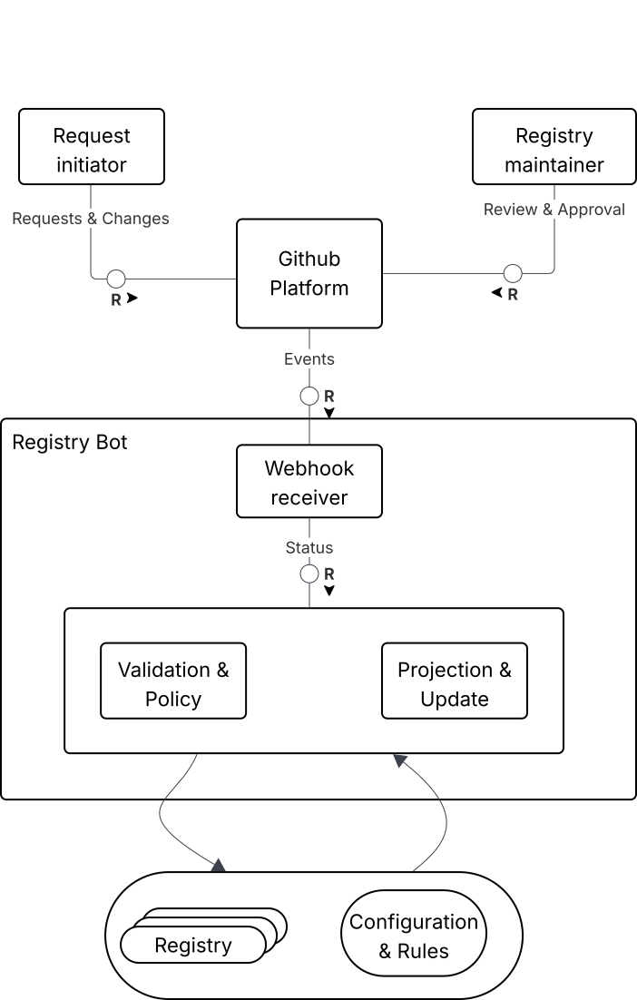

# Registry Bot

Registry Bot is a configuration-driven GitHub App built with Probot. It automates registry request handling in a target repository by validating GitHub issues, creating registry YAML pull requests, routing approvals, and merging safe changes when the repository rules allow it.

The bot is generic. Repository-specific behavior is configured in the target repo:

```text
.github/registry-bot/config.yaml or config.yml
.github/registry-bot/config.js           # optional runtime hooks
.github/ISSUE_TEMPLATE/*.yml             # request forms
.github/registry-bot/request-schemas/*   # JSON schemas
```

## What the bot does

- Parses GitHub Issue Forms into request data.
- Validates requests with JSON Schema and optional repo hooks.
- Checks duplicate registry entries before creating PRs.
- Creates branches, YAML files, and pull requests for valid requests.
- Routes manual approvals through configurable labels and assignees.
- Supports parent-owner and contact-owner approval gates.
- Supports `onApproval` hooks for automatic approval decisions.
- Handles standalone direct registry PRs.
- Keeps workflow state labels exclusive, for example `Requester Action`, `CPA Action`, `Parent Owner Action`, `Approved`, or `Rejected`.
- Uses a sequential direct-PR queue to avoid parallel registry updates and CI overload.
- Can approve pending workflow runs only for safe registry-only PRs with an existing trust signal.

## High-level architecture

```text
GitHub Webhook
  -> Probot App
    -> Target Config Loader
      -> Issue Template Parser
      -> JSON Schema Validator
      -> Optional Hook Worker
        -> Optional external validation API
    -> GitHub Issue / PR / Label / Review APIs
    -> Registry YAML Pull Request
```

GitHub remains the system of record. The bot stores request state through GitHub issues, pull requests, comments, labels, reviews, and hidden metadata markers in issue bodies. The bot does not maintain a separate persistent database for request content.

## Request lifecycle

1. A requester opens an issue using a configured Issue Form.
2. The routing label selects the request type.
3. The bot parses the issue body and validates it.
4. If validation fails, the bot posts one validation comment and sets the configured requester-action label.
5. If ownership approval is required, the bot routes to the correct owner state, for example `Parent Owner Action`.
6. If validation and gates pass, the bot either:
   - creates a PR directly, or
   - routes the request to manual review, or
   - auto-approves when `onApproval` returns an approved decision.
7. The bot creates or updates labels so that only one workflow state is active at a time.

## Direct registry PR lifecycle

Standalone direct registry PRs are PRs that modify registry YAML files.

The bot:

- reads changed registry YAML files,
- resolves request type and resource name,
- runs `onApproval` file by file,
- rejects the PR if any file is rejected,
- routes to manual review if approval is unknown or incomplete,
- creates a real PR review approval for approved cases,
- merges only when approval applies to the current head and checks are green.

Green CI alone is not enough for merge.

## Workflow run approval

Some GitHub/GHES setups require maintainers to approve workflow runs for PRs from forks or contributors.

The bot may attempt to approve pending workflow runs only when all of these are true:

- the PR is open and not draft,
- the PR changes only registry YAML files,
- no workflow or bot/config code is changed,
- the PR has a trust signal:
  - `onApproval` returned `approved`, or
  - a valid current-head approval already exists.

Without a trust signal, the bot does not bypass GitHub's manual workflow approval gate.

## Configuration

Minimal target repo config:

```yaml
requests:
  systemNamespace:
    folderName: /data/namespaces
    schema: './request-schemas/system-namespace.schema.json'
    issueTemplate: '../ISSUE_TEMPLATE/1-system-namespace-request.yaml'

pr:
  branchNameTemplate: 'feat/resource-{resource}-issue-{issue}'
  titleTemplate: 'Add {type} `{resource}`'
  autoMerge:
    enabled: true
    method: squash

workflow:
  labels:
    authorAction: 'Requester Action'
    approverAction: 'CPA Action'
    parentOwnerAction: 'Parent Owner Action'
    approvalRequested: ['CPA Action']
    approvalSuccessful: ['Approved']
    approvalRejected: ['Rejected']
    autoMergeCandidate: 'auto-merge-candidate'
  approvers: ['<login-name>']
  approversPool: ['<login-name>']
```

Important fields:

| Field | Purpose |
| --- | --- |
| `requests.*.folderName` | Target folder for generated registry YAML. |
| `requests.*.schema` | JSON schema for validation. |
| `requests.*.issueTemplate` | GitHub issue template used for this request type. |
| `requests.*.approvers` | Request-type approvers. |
| `requests.*.approversPool` | Request-type reviewer pool. One deterministic user is assigned, all pool users can approve. |
| `workflow.labels.*` | Labels used for request state and approval state. |
| `workflow.approvers` | Global fallback approvers. |
| `workflow.approversPool` | Global fallback reviewer pool. |

## Runtime hooks

Target repositories can provide optional runtime logic in:

```text
.github/registry-bot/config.js
```

Supported hooks:

| Hook | Purpose |
| --- | --- |
| `beforeValidate(args)` | Optional form normalization before validation. |
| `onValidate(args)` / `customValidate(args)` | Additional validation after schema projection. |
| `onApproval(args)` | Business decision for automatic approval, rejection, or manual review. |

`onApproval` can return:

```js
{ status: 'approved', message: '...' }
{ status: 'rejected', message: '...', errors: [...] }
{ status: 'unknown', approvers: ['USER'], message: '...' }
```

No response or no match means the normal review flow continues.

## Hook secrets

Hook secrets are provided through environment variables prefixed with `HOOK_SECRET_`.

Example:

```text
HOOK_SECRET_STC_URL=https://example.invalid
HOOK_SECRET_BASIC_AUTH=Basic ...
```

Inside `config.js`:

```js
const stcUrl = config.getSecret('STC_URL');
const basicAuth = config.getSecret('BASIC_AUTH');
```

The `HOOK_SECRET_` prefix is removed before the value is exposed to the hook. Secrets are scoped to hook execution and should not be stored in target repo config files.

## External service validation and STC scope

External lookups are optional and target-repo controlled through `config.js`.

For STC Service ID validation, the intended behavior is limited to a technical existence check:

```text
/serviceService/Services?$top=1&$select=ID&$filter=ID eq 'SERVICE-...'
```

The hook only checks whether the submitted STC Service ID exists.

The bot does not request, read, process, or store STC personal data such as:

- creator,
- owner,
- responsible person,
- modifiedBy,
- contact person,
- or similar user-related STC fields.

The bot also does not store STC response payloads. It only uses the lookup result to decide whether the submitted request field is valid. If the ID does not exist or the lookup fails, the bot returns a validation error on the request.

Purpose: registry data quality validation, not personal data processing.

## Security boundaries

- The bot is installed as a GitHub App on target repositories.
- Hook HTTP calls should be limited to allowed hosts and HTTPS endpoints.
- Secrets are loaded from deployment environment variables, not from repository files.
- The bot does not auto-merge PRs without current-head approval and green checks.
- The bot does not approve workflow runs for untrusted registry-only PRs without a trust signal.
- Workflow approval automation requires GitHub App `Actions: write` permission.

## Required GitHub App permissions

Minimum permissions depend on enabled features:

| Permission | Level | Why |
| --- | --- | --- |
| Metadata | Read | Required by GitHub Apps. |
| Issues | Read & write | Read issues, comments, labels, assignees, update state. |
| Pull requests | Read & write | Create reviews, update/merge/close PRs. |
| Contents | Read & write | Read config/schemas and write registry YAML files. |
| Checks | Read | React to CI/check results. |
| Actions | Read | Read workflow runs. |
| Actions | Write | Only needed for workflow run approval automation. |

## Local development

```bash
npm install
npm test
```

For integration testing, install the GitHub App on an example registry repository and configure:

```text
.github/registry-bot/config.yaml
.github/registry-bot/config.js
.github/ISSUE_TEMPLATE/*.yml
.github/registry-bot/request-schemas/*.json
```

## Operational notes

- The bot validates config on default-branch updates.
- Existing issues remain compatible when templates gain new required fields.
- Failed or blocked direct PR heads are skipped temporarily so the sequential queue can continue.
- Hidden markers are used for routing lock, parent approval, contact approval, and snapshot tracking.

## Architecture

### Block diagram



> Source file: [docs/Registry-bot-TAM-Block-Diagram.svg](docs/Registry-bot-TAM-Block-Diagram.svg)

### Activity diagram

Shows the flow until PR creation and auto-merge setup.


> Source file: [docs/Activity v0.svg](docs/Activity%20v0.svg)

### Sequence diagram

Shows the happy path call sequence.


> Source file: [docs/Sequence v0.svg](docs/Sequence%20v0.svg)

## Acknowledgements

- Built with [Probot](https://probot.github.io).
